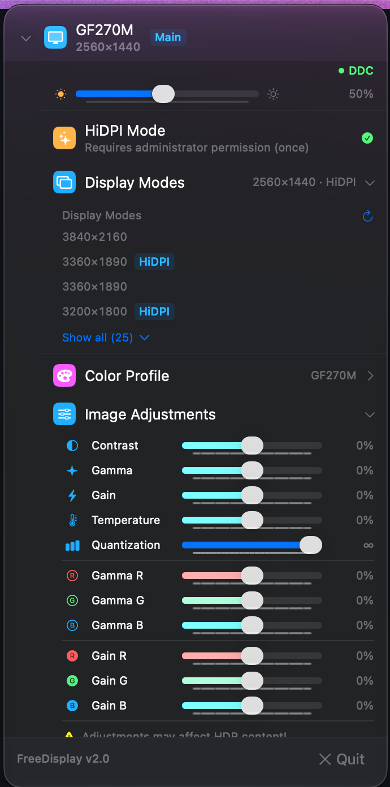
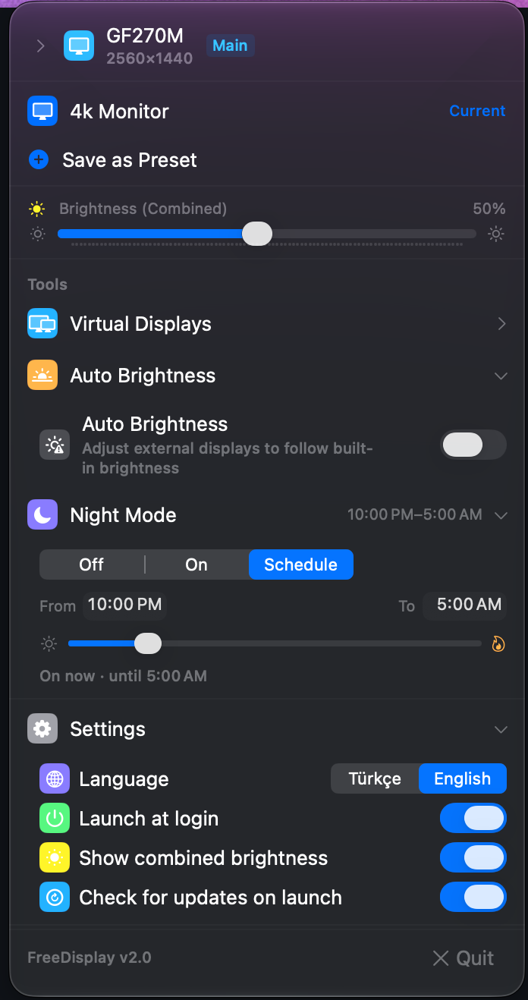

# FreeDisplay

> **Free & open-source alternative to [BetterDisplay](https://github.com/waydabber/BetterDisplay)**

BetterDisplay is a great app, but its best features are locked behind a paid Pro license. FreeDisplay implements the most essential BetterDisplay features as a completely free, open-source macOS menu bar app.

[Download Latest Release](https://github.com/hakanotal/FreeDisplay/releases/latest) | [Report an Issue](https://github.com/hakanotal/FreeDisplay/issues)

---

> maintained by [@hakanotal](https://github.com/hakanotal)   

[](https://buymeacoffee.com/hakantotal)

---

## What's Changed in This Fork

- **macOS 27 fixes** — menu no longer collapses to just the footer, and it shrinks back when sections collapse
- **Crash fixes** — brightness/presets, color profiles, resolution fallback and display arrangement no longer crash the app
- **Color profile** — shows the active profile (e.g. your monitor's own) instead of "Unknown", and updates live; only display-compatible profiles are listed (picking a CMYK/gray profile used to crash)
- **HiDPI** — asks for your password once per monitor instead of on every enable/disable
- **Cleaner menu** — removed the built-in "Native Mode" / "HiDPI Mode" preset buttons; settings switches right-aligned
- **Auto-restart** — with "Launch at login" on, FreeDisplay relaunches itself after a crash (Quit still quits)
- **Night mode** — blue light filter that warms all displays, always on or on a daily schedule
- **Turkish + English UI** — full Turkish translation; switch languages live in Settings → Dil / Language
- **Display arrangement (v2.2)** — drag displays and they snap into place like in System Settings; the layout no longer jumps back after a few seconds, and macOS remembers it. "Keep external displays above built-in" is now an optional switch
- **Built-in brightness on Apple Silicon (v2.2)** — the built-in slider, combined slider and auto brightness now actually work on M-series Macs
- **Notch (v2.2)** — "Hide notch area" blacks out the menu bar row around the notch, keeps menu items visible and is remembered
- **Reliability (v2.2)** — settings are restored after sleep and at login, image adjustments no longer reset your color profile, turning HiDPI off for a monitor sticks. See the [CHANGELOG](CHANGELOG.md) for the full list

---

## What BetterDisplay Features Does This Replace?

| BetterDisplay Feature | FreeDisplay | Notes |
|----------------------|:-----------:|-------|
| DDC Brightness | ✅ | Hardware control via IOKit I2C (Intel) / IOAVService (Apple Silicon); software dimming when DDC isn't available |
| Software Brightness (Gamma) | ✅ | Per-display gamma table control with smooth transitions |
| Keyboard Brightness Keys for External Displays | ✅ | Intercepts brightness keys when cursor is on external display, shows native macOS OSD |
| Auto Brightness Sync | ✅ | Syncs external display brightness with built-in display changes |
| HiDPI Modes | ✅ | Adds HiDPI (Retina) modes to external monitors via display override files |
| Display Arrangement | ✅ | Drag to arrange with edge snapping, set the main display, optional "external above built-in" |
| Resolution & HiDPI Switching | ✅ | Browse and switch all available display modes including HiDPI |
| ICC Color Profile Management | ✅ | Switch color profiles per display via ColorSync |
| Image Adjustment (Gamma/Temperature) | ✅ | Software contrast, color temperature, RGB channels, invert |
| Display Presets | ✅ | Save & restore full display configurations with one click |
| Virtual Display (Dummy) | ✅ | Create virtual displays via the CGVirtualDisplay private API; switch them on and off |
| Notch Management | ✅ | Black out the menu bar row around the MacBook notch (menu items stay visible) |
| Launch at Login | ✅ | Per-user launchd agent; also restarts FreeDisplay after a crash |

### Not Included (intentionally)

- Screen streaming / PiP — rarely used, adds complexity
- EDID override — requires SIP disabled
- XDR/HDR extra brightness — requires specific hardware

---

## Screenshots

<p align="center">
  
  
  
</p>

---

## Installation

### Option 1: Download DMG

1. Download the latest `FreeDisplay-<version>.dmg` from [Releases](https://github.com/hakanotal/FreeDisplay/releases/latest) (universal: Apple Silicon + Intel, macOS 14+)
2. Open the DMG and drag **FreeDisplay.app** to **Applications**
3. First launch: the app isn't notarized, so macOS blocks it once. Open it, then go to **System Settings → Privacy & Security** and click **Open Anyway** — or run:
   ```bash
   xattr -dr com.apple.quarantine /Applications/FreeDisplay.app
   ```

### Option 2: Build from Source

```bash
git clone https://github.com/hakanotal/FreeDisplay.git
cd FreeDisplay
./scripts/build-dmg.sh   # → build/FreeDisplay.app and build/FreeDisplay-<version>.dmg
```

Xcode is optional: without it the script builds with the Command Line Tools (`xcode-select --install`). With Xcode you can also open `FreeDisplay.xcodeproj` (regenerate it with `xcodegen generate` after editing `project.yml`).

---

## Permissions

| Permission | Why |
|------------|-----|
| **Accessibility** | Required for brightness key interception on external displays |
| **Administrator password** (once per monitor brand) | Turning HiDPI on or off writes override files under `/Library/Displays` |

No internet connection required (except optional update checks via GitHub Releases API).

---

## Tech Stack

- **Swift 6** + **SwiftUI** (MenuBarExtra)
- **IOKit** — DDC/CI I2C for hardware brightness
- **CoreGraphics** — Display enumeration, resolution, arrangement
- **ColorSync** — ICC color profile management
- **CGVirtualDisplay** — Virtual display creation (private API, macOS 14+)
- **DisplayServices** — Built-in display brightness on Apple Silicon (private API, via dlopen)
- Zero third-party dependencies

---

## Project Structure

```
FreeDisplay/
├── App/              # AppDelegate, app entry point
├── Models/           # DisplayInfo, DisplayMode, DisplayPreset, ArrangementLayout
├── Services/         # System-level services (DDC, brightness, resolution, gamma, etc.)
├── Utilities/        # Small AppKit helpers
└── Views/            # SwiftUI views for each feature section
```

---

## How It Works

FreeDisplay sits in your menu bar and talks directly to your displays:

- **External monitors**: Uses the DDC/CI protocol over I2C (Intel) or IOAVService (Apple Silicon) to control hardware brightness. If a monitor doesn't answer DDC (common with USB-C dongles and docks), FreeDisplay dims it in software through the display's gamma table instead
- **Built-in display**: Uses the system brightness control (DisplayServices on Apple Silicon, IOKit on Intel)
- **Brightness keys**: Installs a CGEventTap to intercept keyboard brightness keys and route them to the display under your mouse cursor
- **Auto brightness**: Polls the built-in display brightness and proportionally adjusts external displays
- **Arrangement**: Moves all displays in one configuration change that macOS saves, like System Settings does
- **HiDPI**: Writes display override plists to `/Library/Displays` so macOS offers HiDPI modes (they appear after the monitor reconnects)

---

## Contributing

Issues and PRs welcome. This project uses:
- `xcodegen` for project generation (edit `project.yml`, not `.xcodeproj`)
- Swift 6 with `SWIFT_STRICT_CONCURRENCY: minimal`
- Views → Services (singletons) → system frameworks; see [docs/ARCHITECTURE.md](docs/ARCHITECTURE.md) and [docs/LESSONS.md](docs/LESSONS.md) before changing display code

---

## Contributors

- [@huberdf](https://github.com/huberdf) — original author
- [@hakanotal](https://github.com/hakanotal) 

---

## License

MIT License — see [LICENSE](LICENSE) for details.

---

## Acknowledgments

- Inspired by [BetterDisplay](https://github.com/waydabber/BetterDisplay), [MonitorControl](https://github.com/MonitorControl/MonitorControl), and [Lunar](https://lunar.fyi/)
- CGVirtualDisplay bridging header based on [Chromium's virtual_display_mac_util.mm](https://chromium.googlesource.com/chromium/src/+/main/ui/display/mac/test/virtual_display_mac_util.mm)
